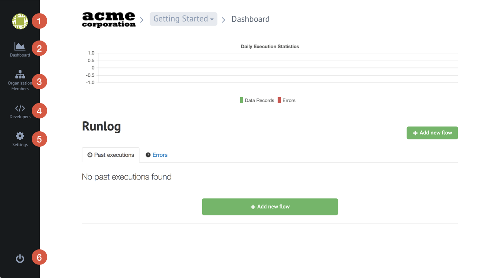
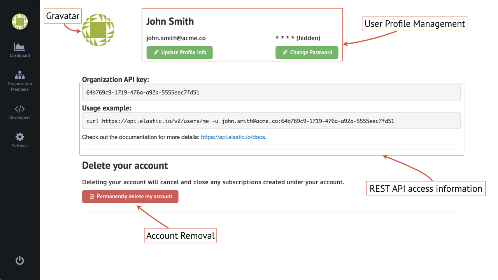
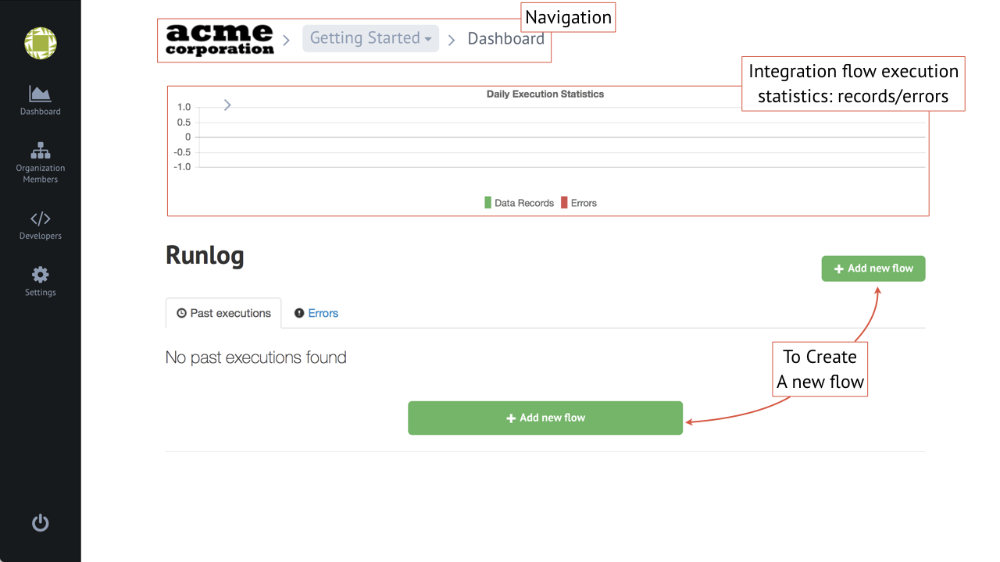
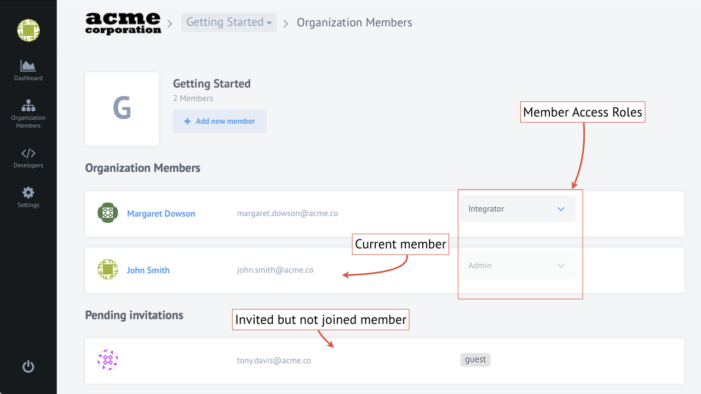
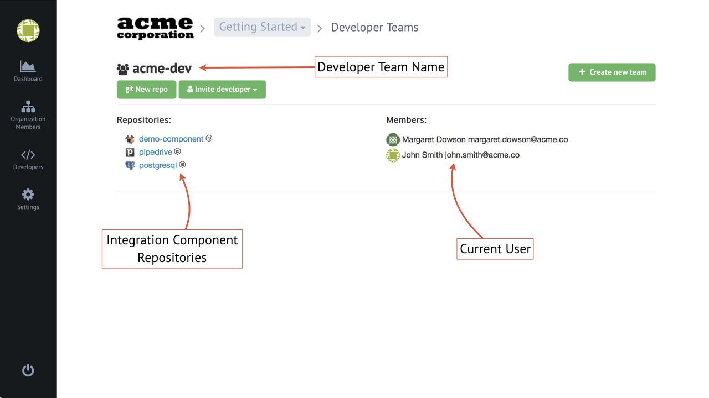
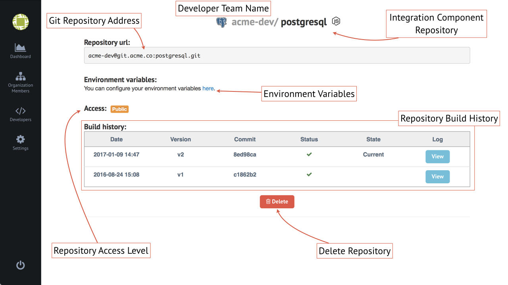
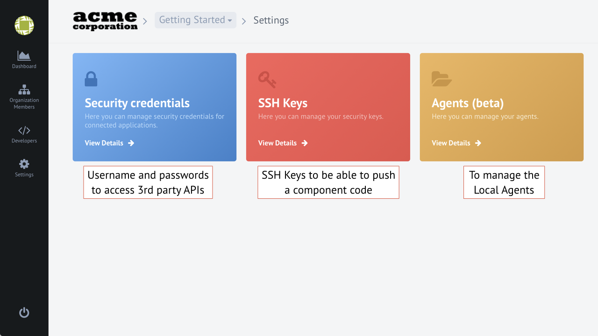

Welcome to the user {{site.data.tenant.name}} interface tour. After first login you will see a similar view:

Picture above shows the {{site.data.tenant.name}} dashboard. While helping to build and run integration flows is the main goal of this interface there are certain settings and options that we would like to point to for your reference. The numbers show important sections which get explained further down in the tour:

1.  [The user profile page](#the-user-profile)
2.  [The dashboard](#the-dashboard)
3.  [Organisation management page](#organisation-management)
4.  [Developer section](#developer-section)
5.  [Settings](#settings)
6.  This is how you log-out.

## The user profile

Click on the gravatar picture from any page of the {{site.data.tenant.name}} interface to access the user profile page.

The user profile page on {{site.data.tenant.name}} platform interface gives access to:
*   Your credentials that you've used during the registration. You can update them any time.
*   Your **unique API Key** to authorise your access to our Rest API.
*   Permanently deleting your account. Please note you would need to supply your current password to authorise this action.

## The dashboard

This is the dashboard. As this is the first time you login into the platform it will look pretty much empty since you haven't created any [integration flows](integration-flow.html):

## Organisation management

Organisation page is for managing users in the current organisational infrastructure. Here is an example how the organization section might look like:

Picture shows the management page for `Getting Started` organisation with the current and pending members. On this configuration page, you can:
*   Manage the access levels of all members in this organization. Access levels can be: Guest, Integrator or Admin.
*   Invite new user into the current organisation with a specific access role.

The current member has an Admin role which gives him/her an ability to change anything but it's own access role. Access roles page has more details.

## Developer section

The developer section is for managing [developer teams](../developer-guide/teams-and-repos.html), integration repositories and their environment variables. Here is an example how a developer section might look like with one team and 3 [integration components](integration-component.html) already deployed:

In the developer section you can:
*   Create a developer team to work on a development of any number of custom components.
*   Invite your fellow developers to join the team to work on any number of integration components.
*   Create any number of component repositories. For every new created repository, a page with instructions on how to deploy your custom code will be shown.

Each integration component resides in a separate repository. Click on any repository name here to go to the individual page like this:

The picture shows the `postgresql` integration component repository page. Here you can get the following information:

*   The exact `git` repository address to deploy the code to.
*   Access the custom environment variables page for this integration component.
*   Review the build history of the current repository and see the deployment logs
*   Set the access level for the current repository
*   Delete the repository

## Settings

The settings page is for managing your [security credentials](credential.html), [SSH Keys](../developer-guide/ssh-key.html) and Local Agents. The page looks like this:

